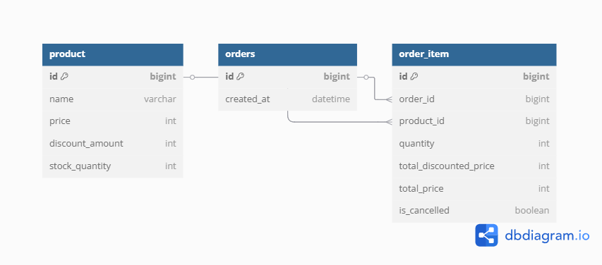

# order-service
- - - 
## History
| Date       |Author| Description |
|:-----------|:---|:------------|
| 2025-06-09 |김채원| 주문 서비스 API  | 

## Getting Started
### System Requirements
|Name|Version| Description                                                                             |
|---|:---:|:----------------------------------------------------------------------------------------|
|OpenJDK|17.0.6| 현재 실무에서 사용중인 버전                                              |
|Springboot|3.5.0| SNAPSHOT 이 아닌 버전 중 가장 최신버전|

### How To Run
+ 프로젝트 실행
  + http://localhost:8080/swagger-ui/index.html# 접속
+ H2 DB 콘솔
  + http://localhost:8080/h2-console 접속
  + JDBC URL : jdbc:h2:mem:testdb 입력
  + User Name: sa 입력
  + Password: 없음


## Development
### Overall Process
```
요구사항 정리 -> DB 설계 -> 프로젝트 구조 정의 -> 구현 & 테스트 -> 리팩토링 
```
### Dependencies
+ spring-boot-starter-web
    + 스프링부트의 코어
    + 웹 어플리케이션 개발 기본 의존성 제공
+ spring-boot-starter-validation
  + Request DTO 유효성 검사
+ spring-boot-starter-data-jpa
  + JPA(Hibernate)를 사용하여 ORM, Repository 구현
+ springdoc-openapi-starter-webmvc
  + Swagger UI, 문서화 기능 제공
+ lombok
  + 애노테이션 기반 생성자, Builder, 유효성 검사 제공
+ h2database
  + 인메모리 기반 H2 DB
+ spring-boot-starter-test
  + 테스트 지원
## Architecture
### 계층 구조
실무에서는 비즈니스(주문,회원,상품) 중심으로 패키지를 생성하고 하위에 controller, service, dto 를 위치시키지만 과제에서는 비즈니스 종류가 많지 않기 때문에 계층 중심으로 구조를 만들었습니다.
```
com.assignment.order_service
├── controller                # 👉 API 컨트롤러
│   └── OrderController.java
│
├── service                   # 👉 비즈니스 로직 인터페이스
│   ├── OrderService.java
│   └── Impl                  # 👉 비즈니스 로직 구현
│
├── dto                       # 👉 요청/응답 객체
│
├── enums                     # 👉 enum
│
├── domain                    # 👉 JPA Entity + Repository
│
├── exception                 # 👉 예외 처리
│
└── OrderServiceApplication.java

```
### ERD & 도메인 설계

주문 관련 테이블은 DELETE 연산을 수행하지 않는다.
1. product

   상품 정보를 저장하는 테이블.

   재고 차감과 할인 적용을 위한 discount_amount, stock_quantity 필드 존재.

2. orders

   사용자의 단일 주문건을 관리하는 테이블.

   1개의 단일 주문이 여러 상품을 포함할 수 있어서 order_item 과 1:N 관계를 가진다.
3. order_item

   단일 주문에서 어떤 상품을 몇 개 주문했는지 관리하는 테이블.

   is_cancelled 컬럼을 통해 상품 단위의 취소 여부를 관리한다.

   관리자에 의해 상품 정보가 변동될 수 있으니 discounted_price 와 total_price 를 별도로 저장한다.

## API
### 주문 생성 API
...
### 주문 상품 개별 취소 API
...
### 주문 상품 조회 API
...

## Manual
