# order-service
- - - 
## History
| Date       |Author| Description |
|:-----------|:---|:------------|
| 2025-06-09 |김채원| 주문 서비스 API  | 

## Getting Started
### System Requirements
|Name|Version| Description                                                                             |
|---|:---:|:----------------------------------------------------------------------------------------|
|OpenJDK|17.0.6| 현재 실무에서 사용중인 버전                                              |
|Springboot|3.5.0| SNAPSHOT 이 아닌 버전 중 가장 최신버전|

### How To Run
+ 프로젝트 실행
  + http://localhost:8080/swagger-ui/index.html# 접속
+ H2 DB 콘솔
  + http://localhost:8080/h2-console 접속
  + JDBC URL : jdbc:h2:mem:testdb 입력
  + User Name: sa 입력
  + Password: 없음


## Development
### Overall Process
```
요구사항 정리 -> DB 설계 -> 프로젝트 구조 정의 -> 구현 & 테스트 -> 리팩토링 
```
### Dependencies
+ spring-boot-starter-web
    + 스프링부트의 코어
    + 웹 어플리케이션 개발 기본 의존성 제공
+ spring-boot-starter-validation
  + Request DTO 유효성 검사
+ spring-boot-starter-data-jpa
  + JPA(Hibernate)를 사용하여 ORM, Repository 구현
+ springdoc-openapi-starter-webmvc
  + Swagger UI, 문서화 기능 제공
+ lombok
  + 애노테이션 기반 생성자, Builder, 유효성 검사 제공
+ h2database
  + 인메모리 기반 H2 DB
+ spring-boot-starter-test
  + 테스트 지원
## Architecture
### 계층 구조
실무에서는 비즈니스(주문,회원,상품) 중심으로 패키지를 생성하고 하위에 controller, service, dto 를 위치시키지만 과제에서는 비즈니스 종류가 많지 않기 때문에 계층 중심으로 구조를 만들었습니다.
```
com.assignment.order_service
├── controller                # 👉 API 컨트롤러
│   └── OrderController.java
│
├── service                   # 👉 비즈니스 로직 인터페이스
│   ├── OrderService.java
│   └── Impl                  # 👉 비즈니스 로직 구현
│
├── dto                       # 👉 요청/응답 객체
│
├── enums                     # 👉 enum
│
├── domain                    # 👉 JPA Entity + Repository
│
├── exception                 # 👉 예외 처리
│
└── OrderServiceApplication.java

```
### 네이밍 규칙
+ 서비스 메서드 이름 규칙: 카멜케이스 사용, 동사형으로 이름 짓기
+ 테스트 메서드 이름 규칙: 스네이크케이스 사용, 기능_결과 형식으로 이름 짓기
+ DTO 클래스 이름 규칙: Request, Response 접미사 붙여서 구분.

### 공통 응답 처리 및 예외 처리
클라이언트에서 HTTP Status Code 만으로 비즈니스 로직을 처리하는 데 한계가 있습니다.
그래서 클라이언트가 비즈니스 성공/실패 응답을 일관되게 받을 수 있도록 BusinessResponse 구조를 정의했습니다.
예외 처리 시 @RestControllerAdvice 에서 받아서 BusinessResponse 형태로 리턴합니다.
비즈니스 코드는 Enum 으로 관리되며 
성공/실패 응답 모두 아래와 같은 body 로 응답됩니다.
```
{
  "data": {
    "resultCode": "SUCCESS_CODE or ERROR_CODE",
    "resultMessage": "응답 메시지",
    "resultData": { ... }
  }
}
```
### ERD & 도메인 설계

주문 관련 테이블은 DELETE 연산을 수행하지 않는다.
1. product

   상품 정보를 저장하는 테이블.

   재고 차감과 할인 적용을 위한 discount_amount, stock_quantity 필드 존재.

2. orders

   사용자의 단일 주문건을 관리하는 테이블.

   1개의 단일 주문이 여러 상품을 포함할 수 있어서 order_item 과 1:N 관계를 가진다.
3. order_item

   단일 주문에서 어떤 상품을 몇 개 주문했는지 관리하는 테이블.

   is_cancelled 컬럼을 통해 상품 단위의 취소 여부를 관리한다.

   관리자에 의해 상품 정보가 변동될 수 있으니 discounted_price 와 total_price 를 별도로 저장한다.

## API
### 주문 생성 API

```mermaid
graph TD; 
B[상품 ID로 Product 조회]
B --> A{유효한 상품 아이디?}
A -- No --> C[PRODUCT_NOT_FOUND 예외]
A -- Yes --> E{재고 수량 ≥ 요청 수량 인지 확인}
E -- No --> F[INSUFFICIENT_STOCK 예외]
E -- Yes --> G[재고 차감]
G --> H[할인 금액 계산]
H --> K[주문생성 성공]
```

### 주문 상품 개별 취소 API

```mermaid
graph TD
D[주문 ID로 Order 조회]
D --> E{주문에 해당 상품이 포함되어 있는지 확인}
E -- No --> F[PRODUCT_NOT_FOUND 예외]
E -- Yes --> G{이미 취소된 상품인지 확인}
G -- Yes --> H[ALREADY_CANCELLED 예외]
G -- No --> I[isCancelled = true 설정]
I --> J[상품 재고 복구]
J --> K[환불 금액 계산]
K --> L[남은 주문 금액 계산]
L --> M[개별 취소 성공]
```

### 주문 상품 조회 API

```mermaid
graph TD;
D[주문 ID로 Order 조회]
D --> A{주문 존재 여부 확인}
A -- No --> B[ORDER_NOT_FOUND 예외]
A -- Yes --> E[주문에 포함된 주문 항목 목록 순회]
E --> F[ItemDetail DTO로 매핑]
F --> G[취소되지 않은 항목만 골라 총 금액 계산]
G --> H[주문 상품 조회 성공]
```

## Testing Strategy 
프레임워크로 JUnit5 사용했으며 가독성이 좋은 AssertJ (Assertions.assertThat) 라이브러리를 사용했습니다.

